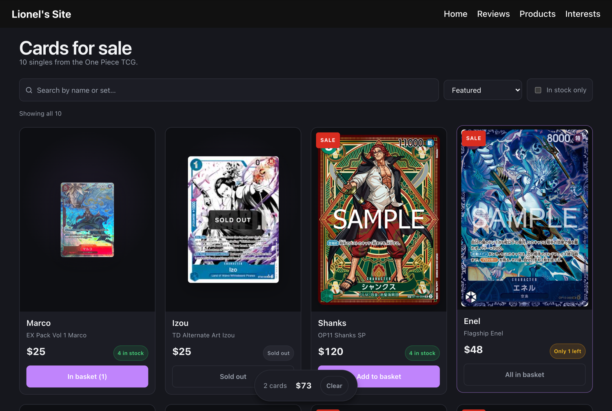
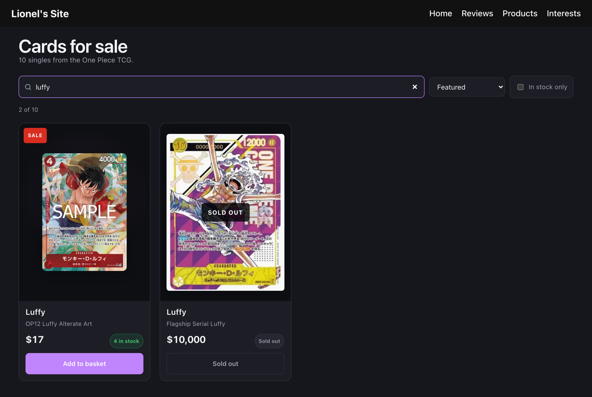
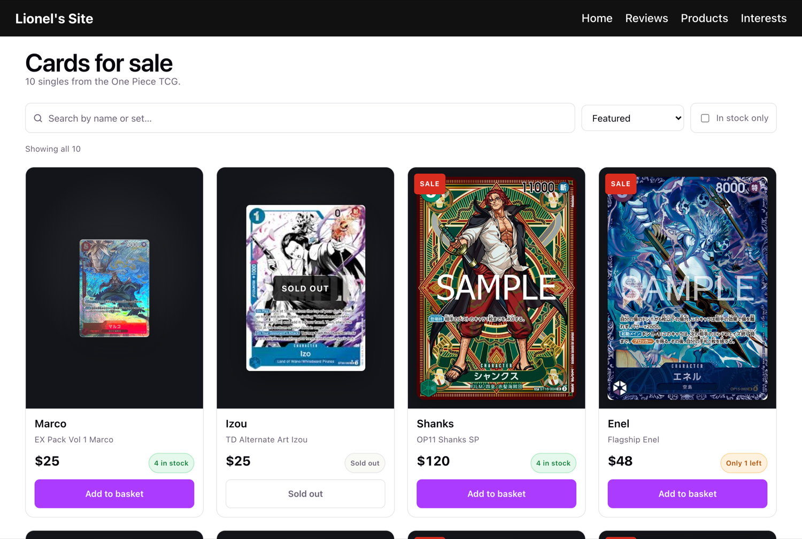

# Card Market

A small marketplace for One Piece TCG singles. React 19 and React Router on
Vite, with the card data held in the repo — no backend.

▶︎ **[Open it](https://react-example-nu-one.vercel.app/)**



## What's in it

| Route        | What it does                                                  |
| ------------ | ------------------------------------------------------------- |
| `/`          | Profile — who's selling                                        |
| `/products`  | The shop: search, sort, filter, and a basket                    |
| `/reviews`   | Reviews, with a form to leave one and a star rating            |
| `/interests` | What the seller collects                                        |

## The shop

Each listing shows the card at its real 5:7 proportions — a trading card is
bought on its frame, art and rarity marks, so it's never cropped. Price carries
the typographic weight, because price is what the page is for. Stock is shown
as a state rather than a raw count: **in stock**, **only 2 left**, or
**sold out**, with the buy button disabled when there's nothing to sell.

Search matches on name or set. Sorting covers price and name. "In stock only"
hides what can't be bought. The count line reports how much of the catalogue
you're looking at, and an empty search offers a way back out.



The basket totals as you add, and it will never let you add more of a card than
the listing actually has.

## Both themes

The whole interface follows `prefers-color-scheme`, driven by CSS custom
properties in `src/index.css`. The card art sits in a dark well in **both**
themes — the art is vivid, and a white surround washes it out.



## Running it

```bash
npm install
npm run dev
```

Then open the printed URL. `npm run build` produces `dist/`.

> Vite 8 needs Node 20.19+ or 22.12+. On an older Node the dev server fails
> to start with a rolldown native-binding error.

## Layout

```
src/
├── components/       one folder per component, JSX beside its CSS
│   ├── ProductCard/  a single listing
│   ├── Products/     the shop: search, sort, filter, basket
│   ├── Reviews/      reviews and the review form
│   └── …
├── data/             cards.js and reviews.js
└── index.css         the theme — colours live here, and only here
```

One rule worth keeping: **component stylesheets don't style the document.**
A global `body` rule in a component file leaks to every route once bundled.
Document-level styling belongs in `index.css`.
